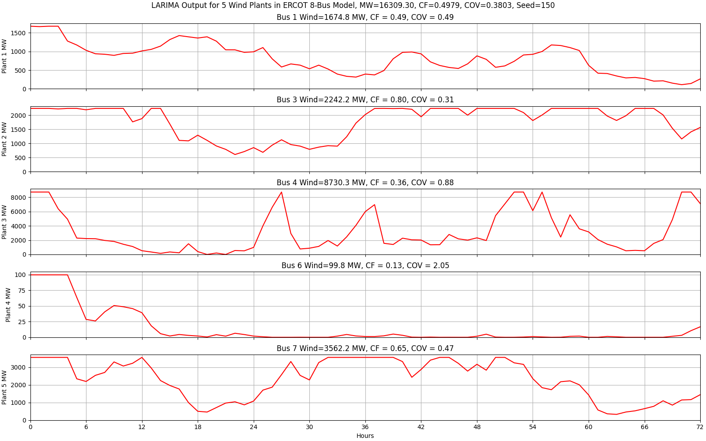

# ERCOT 8-Bus Test System for i2x 

This repository contains Matpower and Python scripts for an
8-bus ERCOT test system with 5 equivalent wind plants.  References: 
 
- [Test System Description](https://doi.org/10.1016/j.apenergy.2020.115182).

- [Synthetic Wind Output Methodology](https://doi.org/10.1109/TPWRS.2009.2033277).

## Directory of Script and Data Files

- **clean.bat** removes output and temporary files from executing scripts
- **mpow\_utilities.py** functions to load input and output from MATPOWER/MOST into Python dictionaries
- **msout.txt** a saved 3-day MOST solution, for which execution takes up to 1 hour
- **plot\_most.py** plots the data from *msout.txt*
- **prep\_most\_profiles.py** creates load and wind profiles for MOST in *test\_resp.m*, *test\_unresp.m*, and *test\_wind.m*. Requires *wind\_plants.dat*.
- **test\_case.m** defines the 8-bus system model buses, branches, and generators
- **test\_resp.m** defines responsive load variation by hour, also called dispatchable load. Overwritten by *prep\_most\_profiles.m*
- **test\_solve.m** script that solves an example in MOST. Tested with Octave.
- **test\_unresp.m** defines unresponsive load variation by hour, also called fixed load. Overwritten by *prep\_most\_profiles.m*
- **test\_wind.m** defines wind plant output variation by hour. Overwritten by *prep\_most\_profiles.m*
- **test\_xgd.m** supplemental parameters for MOST example.
- **test\_wind.py** tests the capacity factor, coefficient of variation, autocorrelation coefficient, and probability density function for synthetic wind
- **wind\_plants.dat** contains three days of hourly wind output for MOST. Overwritten by *wind\_plants.py*.
- **wind\_plants.py** creates hourly output data in *wind\_plants.dat* for the 5 wind plants of different sizes

## Synthetic Wind Plant Results

Figure 1 shows a snapshot of three days hourly wind plant output for use 
in MOST.  The system-level capacity factor (CF) in this three-day window 
is 0.4873 on a total capacity of 16291.50 MW, with a coefficient of 
variation (COV)=0.4366.  Figure 2 shows a full year of hourly output from 
the largest wind plant, using the same seed value for randomization.  The 
CF over the whole year is less than for the three-day window in Figure 1.  
Wind plant output varies, but is correlated with recent values in the time 
series of output values.  Wind plant output is also limited by the cut-in 
and cut-out speeds of the wind turbine, and the nature of its power curve.  
In Figure 2, the autocorrelation coefficient (ACC), partial 
autocorrelation coefficient (PACC), and bi-modal probability density 
function all reflect this expected behavior.  

*Figure 1: Three days of synthetic wind output for the MOST base case, seed=150*

*Figure 2: Annual output for the largest wind plant, seed=150*

## Unit Commitment Example

Figure 3 shows wind plant output and bus load variation over 3 days.  
Figure 4 shows the result of a MOST solution of the unit commitment and 
economic dispatch problem, accounting for these variations.  There is no 
forecasting error in this example, so the results are optimistic.  Steps 
to run this example, assuming that *wind\_plants.dat* exists from the 
previous section.  

- Run *python prep\_most\_profiles.py 72* to create 72-hour load and wind profiles and Figure 3.
- Start Octave (or MATLAB), then change to this directory.
- From the Octave command-line, run *test\_solve*. This will take several minutes to complete.
- When Octave finishes, run *python plot\_most.py* to create Figure 4.

*Figure 3: Three-days of wind and load variation for MOST example*

*Figure 4: Results of three-day unit commitment example in MOST*

Copyright 2022-2023, Battelle Memorial Institute

