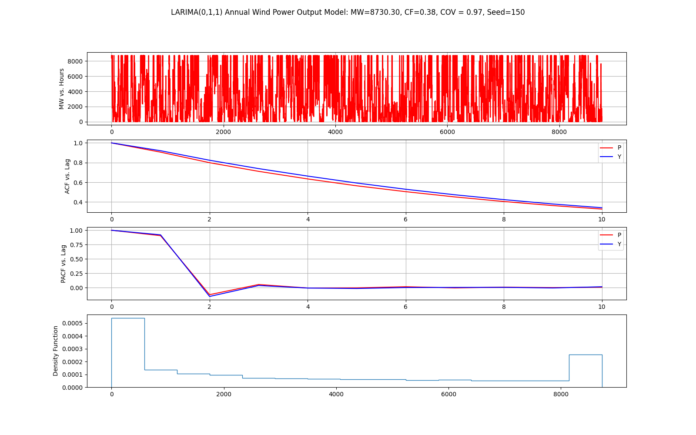

# ERCOT 8-Bus Test System for i2x 

This repository contains Matpower and Python scripts for an
8-bus ERCOT test system with 5 equivalent wind plants.  References: 
 
- [Test System Description](https://doi.org/10.1016/j.apenergy.2020.115182).

- [Synthetic Wind Output Methodology](https://doi.org/10.1109/TPWRS.2009.2033277).

## Directory of Script and Data Files

- **test\_wind.py** tests the capacity factor, coefficient of variation, autocorrelation coefficient, and probability density function for synthetic wind
- **wind\_plants.dat** contains three days of hourly wind output for MOST
- **wind\_plants.py** creates hourly output data in *wind\_plants.dat* for the 5 wind plants of different sizes

## Synthetic Wind Plant Results

Figure 1 shows a snapshot of three days hourly wind plant output for use 
in MOST.  Figure 2 shows a full year of hourly output from the largest 
wind plant, using the same seed value for randomization.  The capacity 
factor (CF) over the whole year is less than for the three-day window in 
Figure 1.  Wind plant output varies, but is correlated with recent values 
in the time series.  Wind plant output is also limited by the cut-in and 
cut-out speeds of the wind turbine, and the nature of its power curve.  In 
Figure 2, the autocorrelation coefficient (ACC), partial autocorrelation 
coefficient (PACC), and bi-modal probability density function reflect this 
behavior.  

*Figure 1: Three days of synthetic wind output for the MOST base case, seed=150*

*Figure 2: Annual output for the largest wind plant, seed=150*

Copyright 2022-2023, Battelle Memorial Institute

