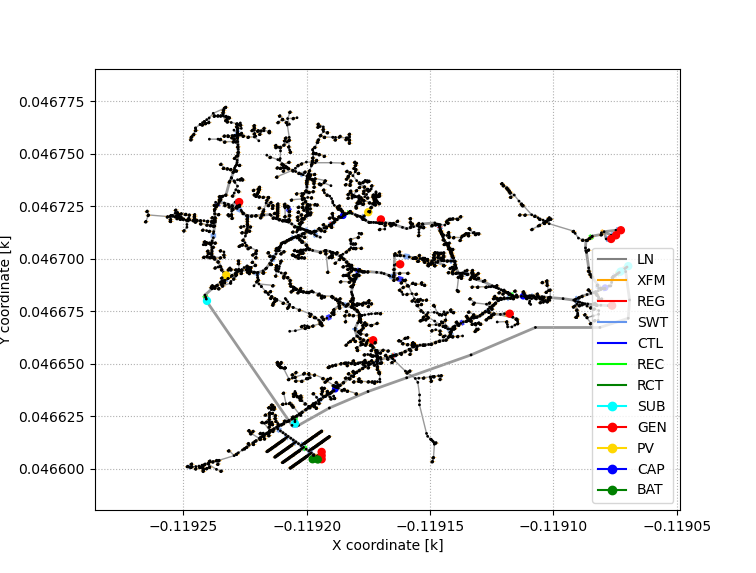

# Hosting Capacity Analysis
## Basic usage
### Step 1: Initialize Object
initialize the hosting capacity object with a configuration file:
```python
import hca as h

inputs = h.load_config("defaults.json")
hca = h.HCA(inputs)
```
### Step 2: Run Baseline Case
The base line case can establish some pre-determined changes to the feeder.
Additionally, the baseline is used when evaluating the hosting capacity metrics.
In the event that the baseline _violates_ any of the limits specified in the input configuration, the limit is changed to being "no worse than the baseline".

```python
hca.runbase()
```

### Step 3: Perform hosting capacity steps
Method `hca_round` performs one "round" of hosting capacity.
In a round:
* A resource type is specified (only `"pv"`` tested presently)
* A location, $n$, is sampled (or specified)
* A capacity, $S_0$, is sampled (or specified)

The following outcomes are possible:
1. No violations with initial capacity $S_0$:
    * A bisection search is performed to find the largest capacity, $S_{lim}$, that doesn't result in violations.
    * A unit with capacity $S_0$ is added at $n$.
    * The hosting capacity is recorded as $S_{lim} - S_0$.
2. Violations occur with initial capacity $S_0$:
    * A bisection search is performed to find the largest capacity, $S_{lim}$, that doesn't result in violations.
    * A unit with capacity $S_{lim}$ is added at $n$.
    * The hosting capacity is recorded as 0.

An HCA round (for a pv unit) is performed via the command:
```python
hca.hca_round("pv")
```
It's also possible to specify either location and/or capacity, for example:
```python
hca.hca_round("pv", bus="n1144663", 
    Sij={"kw":193.5, "kva":241.875})
```
will perform an HCA round at bus `"n1144663"` starting with a capacity of 241.875 kVA.


## Testing/Example
An example/test is available in the `tests` folder, which performs 3 rounds of HCA on the IEEE 9500 Node feeder, and can be run (in the `tests` folder) via:
```
>python ieee9500node_test.py
```

The result should look like this:


_Note_: There are only 2 PV units showing.
That is because the second PV unit selected is very close to the first one, and no hosting capacity was left at that location.